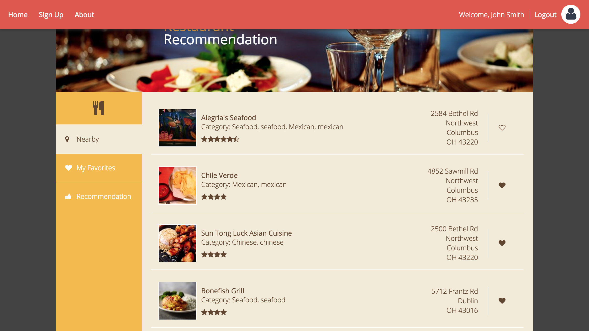

## Description

Eats is a personalized webpage focus on helping people find their favorite restuarants.

## functionality

1. Search nearby resaurants

2. Save your favorite restaurants on the history
3. Recommend your new restaurants

## Recommendation

This recmommendation is content-based, which means I will recommend you with the same categories' restaurants you put them in the history list, but not the same exact restaurants. ^-^.

## Installation

Download this repository into your loacal then use Tomcat Apache Server to start this project. Enjoy!

## API Reference

This project is using Yelp API[https://github.com/Yelp/yelp-api] to fetch the data of restaurants

## License

MIT licience