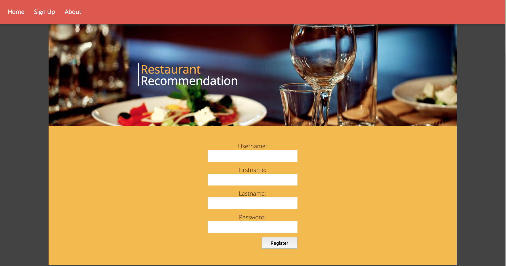
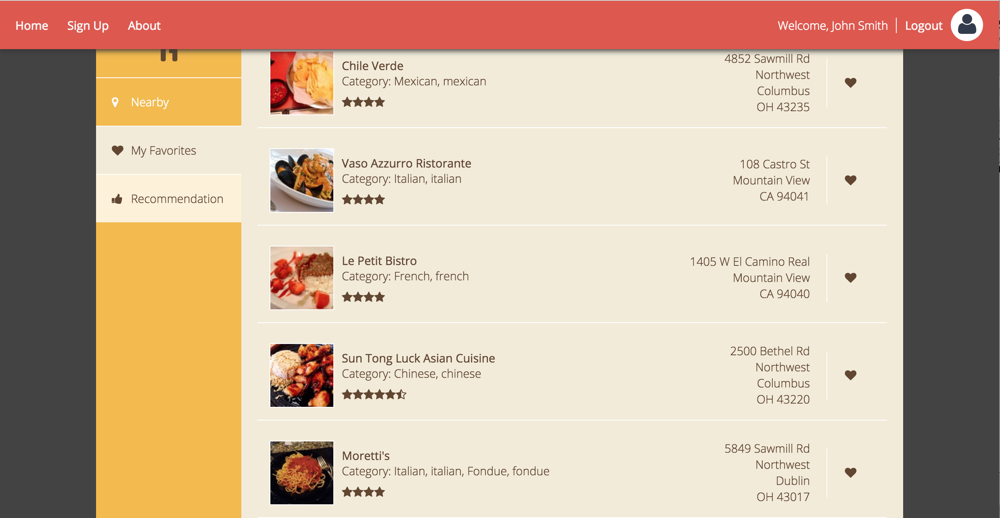
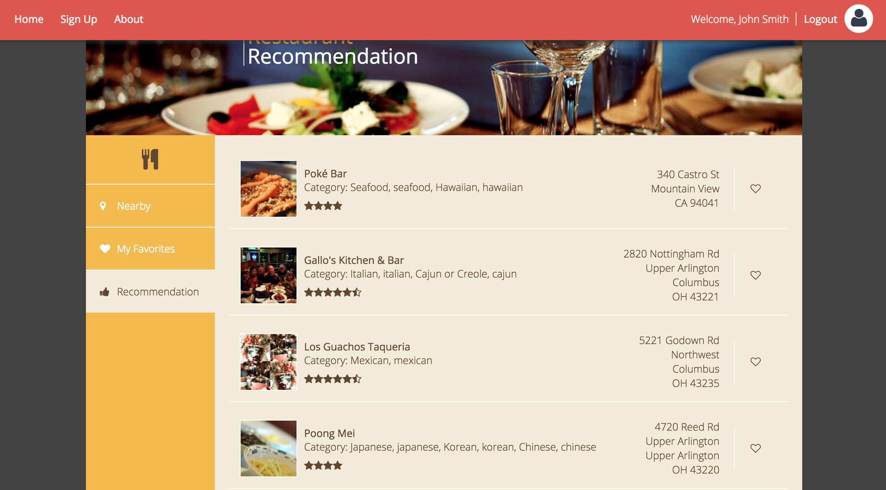

## Description

Eats is a personalized webpage focus on helping people find their favorite restuarants.

## functionality
1.User sign up

2. Search nearby resaurants

3. Save your favorite restaurants on the history

4. Recommend your new restaurants

## Recommendation

This recmommendation is content-based, which means I will recommend you with the same categories' restaurants you put them in the history list, but not the same exact restaurants. ^-^.

## Installation

Download this repository into your loacal then use Tomcat Apache Server to start this project. Enjoy!

## API Reference

This project is using [Yelp API](https://github.com/Yelp/yelp-api)to fetch the data of restaurants

##License

MIT is open-sourced software licensed under the [MIT license](http://opensource.org/licenses/MIT).